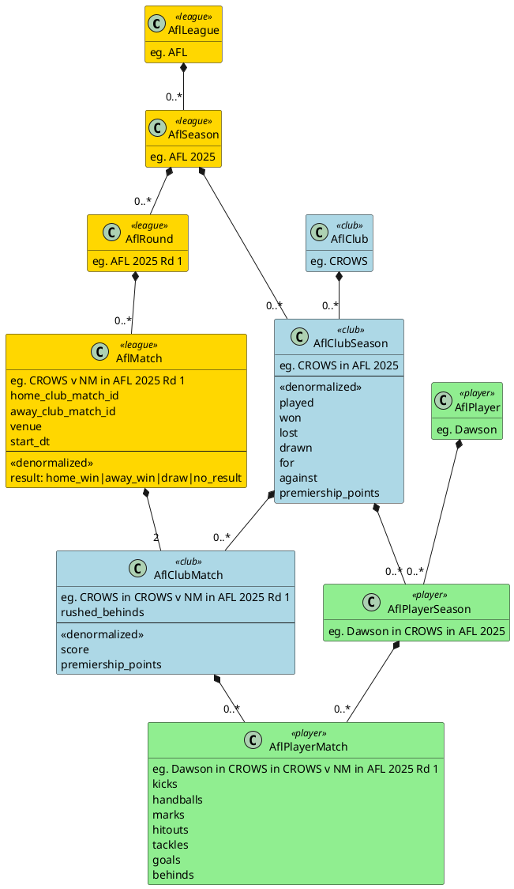
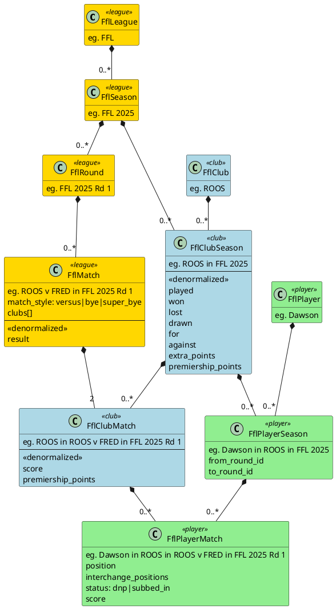

# gffl 

FFL on golang and graphql. Built with a lot of code agent.

A full-stack web application for managing a fantasy football league with GraphQL API.

## Project Structure

```
gffl/
├── backend/           # Go backend with GraphQL API
│   ├── graph/        # GraphQL schema and resolvers
│   ├── main.go       # Application entry point and server setup
│   └── gqlgen.yml    # GraphQL code generation config
└── frontend/         # Vue.js frontend
    ├── src/          # Source code
    ├── public/       # Static assets
    └── index.html    # Entry HTML file
```

## Prerequisites

- Go 1.16 or later
- Node.js 16 or later
- PostgreSQL 13 or later
- npm or yarn

## Database Setup

The application uses PostgreSQL as its database. Here's how to set it up:

### Installing PostgreSQL

#### macOS
```bash
# Install PostgreSQL using Homebrew
brew install postgresql@14

# Start PostgreSQL as service
# If using port other than 5432, you may need to adjust configuration, eg at
# /opt/homebrew/var/postgresql@14/postgresql.conf
brew services start postgresql@14

# Or, if you don't want/need a background service you can just run:
/usr/local/opt/postgresql@14/bin/postgres -D /usr/local/var/postgresql@14

# Create the database
createdb gffl

# Create a PostgreSQL user (if not exists)
createuser -s postgres

# Set password for postgres user
psql postgres -c "ALTER USER postgres WITH PASSWORD 'postgres';"
```

#### Linux (Ubuntu/Debian)
```bash
# Install PostgreSQL
sudo apt update
sudo apt install postgresql postgresql-contrib

# Start PostgreSQL service
sudo systemctl start postgresql
sudo systemctl enable postgresql

# Create the database
sudo -u postgres createdb gffl

# Set password for postgres user
sudo -u postgres psql -c "ALTER USER postgres WITH PASSWORD 'postgres';"
```

### Database Configuration

The application uses environment variables for database configuration. A `.env` file is provided in the backend directory with the following default settings:

```
DB_HOST=localhost
DB_USER=postgres
DB_PASSWORD=postgres
DB_NAME=gffl
DB_PORT=5423
```

You can modify these values in the `.env` file to match your database setup.

### Running Migrations

The database schema is managed through SQL migration files in the `backend/db/migrations` directory. To apply the migrations:

```bash
# Connect to the database
psql -U postgres -d gffl

# Run the migration file
\i backend/db/migrations/001_create_ffl_tables_up.sql
```

Alternatively, you can run the migration directly from the command line:

```bash
psql -U postgres -d gffl -f backend/db/migrations/001_create_ffl_tables_up.sql
```

To revert the migrations, you can run the down migration:

```bash
psql -U postgres -d gffl -f backend/db/migrations/001_create_ffl_tables_down.sql
```

### Test Data

Test data scripts are available in the `backend/db/test_scripts` directory. To insert test data:

```bash
psql -U postgres -d gffl -f backend/db/test_scripts/insert_test_clubs.sql
```

### Verifying the Connection

To verify that the database connection is working:

1. Start the backend server:
   ```bash
   cd backend
   go run main.go
   ```

2. Check the logs for any database connection errors. If there are no errors, the connection is successful.

## Backend Setup

The backend is built with Go and uses gqlgen for GraphQL API generation.

### Key Components

- `main.go`: The application entry point that:
  - Sets up the GraphQL server
  - Configures CORS for frontend communication
  - Handles HTTP routing
  - Sets up the GraphQL playground
  - Manages server configuration and environment variables

### GraphQL Code Generation

After making changes to your GraphQL schema or resolvers, you'll need to regenerate the code:

```bash
cd backend
go run github.com/99designs/gqlgen generate
```

This will:
- Generate type-safe Go code from your GraphQL schema
- Update resolver interfaces
- Create new resolver stubs for any new queries or mutations

### Running the Backend

```bash
cd backend
go run main.go
```

The GraphQL server will start on `http://localhost:8080` with the following endpoints:
- `/query` - GraphQL API endpoint
- `/` - GraphQL playground for testing queries

## Frontend Setup

The frontend is built with Vue 3, TypeScript, and Vite.

### Key Components

- `src/App.vue` - Root component
- `src/router/` - Vue Router configuration
- `src/views/` - Page components
- `src/components/` - Reusable components
- `src/stores/` - Pinia state management
- `src/graphql/` - GraphQL queries and mutations

### Running the Frontend

```bash
cd frontend
npm install
npm run dev
```

The frontend will be available at `http://localhost:3000`.

## Development

1. Start the backend server:
   ```bash
   cd backend
   go run main.go
   ```

2. Start the frontend development server:
   ```bash
   cd frontend
   npm run dev
   ```

3. Access the application:
   - Frontend: http://localhost:3000
   - GraphQL Playground: http://localhost:8080

## Architecture

### Data Model

The application is designed to manage two types of leagues: AFL (Australian Football League) and FFL (Fantasy Football League). Each league has its own set of entities, including seasons, rounds, matches, clubs, and players.

Ostensibly, data is stored in first normal form (1NF). However, at this stage, to optimize read performance for the frontend, some data is denormalized. This includes pre-calculated fields like scores, premiership points, and match results.

#### AFL League Data Model



#### FFL League Data Model


