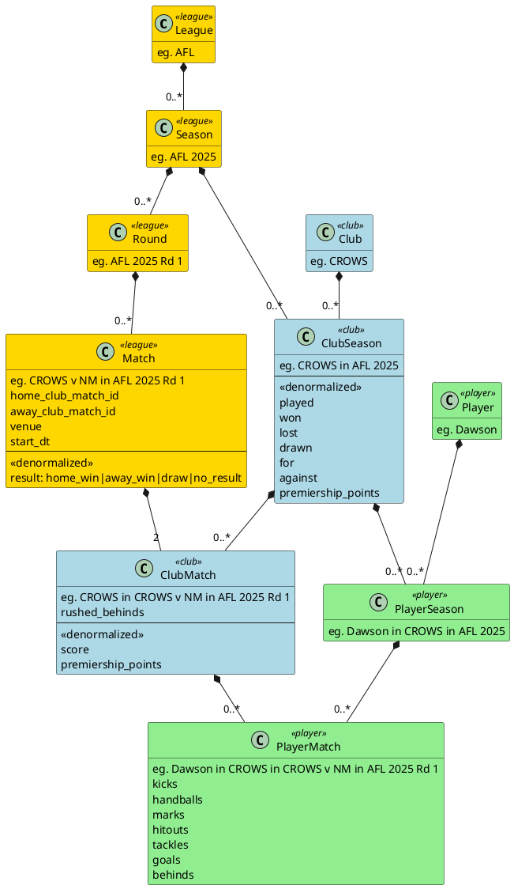

# xffl 

Multi-service fantasy football league application with both AFL and FFL services. Built as a modular architecture with experimentation into DDD, bounded contexts, clean architecture, CQRS, and search.

Totally over engineered for what it does, but, experimenting.

- **AFL** = Australian Football League  
- **FFL** = Fantasy Football League

Primary techs are golang, graphql, postgres, Vue, Zinc

Built with a lot of code agent.

## Prerequisites

- Go 1.16 or later
- Node.js 16 or later
- PostgreSQL 13 or later
- npm or yarn

## Database Setup

The application uses PostgreSQL as its database. Here's how to set it up:

### Installing PostgreSQL

#### macOS
```bash
# Install PostgreSQL using Homebrew
brew install postgresql@14

# Start PostgreSQL as service
# If using port other than 5432, you may need to adjust configuration, eg at
# /opt/homebrew/var/postgresql@14/postgresql.conf
brew services start postgresql@14

# Or, if you don't want/need a background service you can just run:
/usr/local/opt/postgresql@14/bin/postgres -D /usr/local/var/postgresql@14

# Create the database
createdb xffl

# Create a PostgreSQL user (if not exists)
createuser -s postgres

# Set password for postgres user
psql postgres -c "ALTER USER postgres WITH PASSWORD 'postgres';"
```

#### Linux (Ubuntu/Debian)
```bash
# Install PostgreSQL
sudo apt update
sudo apt install postgresql postgresql-contrib

# Start PostgreSQL service
sudo systemctl start postgresql
sudo systemctl enable postgresql

# Create the database
sudo -u postgres createdb xffl

# Set password for postgres user
sudo -u postgres psql -c "ALTER USER postgres WITH PASSWORD 'postgres';"
```

### Database Configuration

The application uses environment variables for database configuration. Copy the example environment file and customize for your setup:

```bash
# For FFL service
cp services/ffl/.env.example services/ffl/.env
# Edit services/ffl/.env with your database credentials

# For AFL service (when available)
cp services/afl/.env.example services/afl/.env
# Edit services/afl/.env with your database credentials
```

Example configuration:
```
DB_HOST=localhost
DB_USER=postgres
DB_PASSWORD=your_password_here
DB_NAME=xffl
DB_PORT=5432
```

**Note**: `.env` files are ignored by git for security. Never commit actual credentials to the repository.

### Running Migrations

The database schema is managed through SQL migration files. To apply the migrations:

```bash
# AFL migrations
psql -U postgres -d xffl -f services/ffl/internal/adapters/persistence/migrations/001_create_afl_tables_up.sql

# FFL migrations  
psql -U postgres -d xffl -f services/ffl/internal/adapters/persistence/migrations/002_create_ffl_tables_up.sql
```

You can revert by running the down migrations.

### Test Data

Test data scripts are available in the service directories. To insert test data:

```bash
psql -U postgres -d xffl -f services/ffl/internal/adapters/persistence/test_scripts/insert_ffl_data.sql
```

## Services Setup

The application consists of multiple Go services using a shared package for common functionality.

### Shared Package

The `pkg/` directory contains shared utilities used by all services:

```bash
# Validate the shared package
 cd pkg
go mod tidy
go test ./...
```

### FFL Service

```bash
# Generate GraphQL code
cd services/ffl
go run github.com/99designs/gqlgen generate

# Build the service
go build -o bin/server cmd/server/main.go

# Or run directly
go run cmd/server/main.go
```

The FFL service will start on `http://localhost:8080` with:
- `/query` - GraphQL API endpoint
- `/` - GraphQL playground for testing queries

### AFL Service (Future)

```bash
# Generate GraphQL code  
cd services/afl
go run github.com/99designs/gqlgen generate

# Build the service
go build -o bin/server cmd/server/main.go

# Or run directly
PORT=8081 go run cmd/server/main.go
```

The AFL service will start on `http://localhost:8081` when implemented.

## Web 
Frontend Setup

### Running the Frontend

```bash
cd frontend
npm install
npm run dev
```

The frontend will be available at `http://localhost:3000`.

## Development

1. Start the FFL service:
   ```bash
   cd services/ffl
   go run cmd/server/main.go
   ```

2. Start the AFL service (when available):
   ```bash
   cd services/afl
   PORT=8081 go run cmd/server/main.go
   ```

3. Start the frontend development server:
   ```bash
   cd frontend
   npm run dev
   ```

4. Access the application:
   - Frontend: http://localhost:3000
   - FFL GraphQL Playground: http://localhost:8080
   - AFL GraphQL Playground: http://localhost:8081

## Project Structure

```
xffl/
├── services/                    # Independent microservices
│   ├── ffl/                    # Fantasy Football League service
│   │   ├── api/graphql/        # FFL GraphQL schema
│   │   ├── cmd/server/         # Service entry point
│   │   ├── internal/           # Service-specific code
│   │   │   ├── domain/         # FFL business entities
│   │   │   ├── application/    # FFL use cases
│   │   │   ├── adapters/       # GraphQL resolvers, persistence
│   │   │   └── ports/          # Interface definitions
│   │   ├── go.mod              # FFL service dependencies
│   │   └── gqlgen.yml          # GraphQL generation config
│   └── afl/                    # Australian Football League service (future)
│       ├── api/graphql/        # AFL GraphQL schema
│       ├── cmd/server/         # Service entry point
│       ├── internal/           # Service-specific code
│       └── go.mod              # AFL service dependencies
├── pkg/                        # Shared packages
│   ├── database/               # Database connection utilities
│   ├── config/                 # Configuration management
│   ├── utils/                  # Common utilities
│   └── go.mod                  # Shared package dependencies
├── frontend/                   # Vue.js frontend
│   ├── src/                    # Source code
│   ├── public/                 # Static assets
│   └── index.html              # Entry HTML file
├── go.work                     # Go workspace configuration
└── go.work.sum                 # Go workspace dependencies (git ignored)
```

## Architecture

### Frontend

#### Key Components

- `src/App.vue` - Root component
- `src/router/` - Vue Router configuration
- `src/views/` - Page components
- `src/components/` - Reusable components
- `src/stores/` - Pinia state management
- `src/graphql/` - GraphQL queries and mutations

### Services Architecture

Each service follows Clean Architecture + Hexagonal Architecture principles:

#### Service Independence:
- **FFL Service** (`services/ffl/`): Handles Fantasy Football League operations (port 8080)
- **AFL Service** (`services/afl/`): Handles Australian Football League operations (port 8081)
- **Shared Package** (`pkg/`): Common utilities used by all services

#### Clean Architecture Layers (per service):
- **Domain Layer** (`services/*/internal/domain/`): Pure business logic, entities, value objects
- **Application Layer** (`services/*/internal/application/`): Use cases and application services
- **Interface Adapters** (`services/*/internal/adapters/`): GraphQL resolvers, persistence adapters
- **Infrastructure** (`pkg/`): Shared database connections, configuration

#### Hexagonal Architecture Ports:
- **Input Ports** (`services/*/internal/ports/in/`): Service interfaces
- **Output Ports** (`services/*/internal/ports/out/`): Repository and external service interfaces

#### Key Components (per service):
- `services/*/cmd/server/main.go`: Service entry point and server setup
- `services/*/internal/adapters/graphql/`: GraphQL resolvers (input adapters)
- `services/*/internal/adapters/persistence/`: Database implementations (output adapters)
- `services/*/internal/domain/`: Service-specific business entities
- `services/*/internal/application/`: Service-specific use cases
- `pkg/database/`: Shared database connection utilities
- `pkg/config/`: Shared configuration management

### Data Model

The application is designed to manage two types of leagues: AFL (Australian Football League) and FFL (Fantasy Football League). Each league has its own set of entities, including seasons, rounds, matches, clubs, and players.

Ostensibly, data is stored in first normal form (1NF). However, at this stage, to optimize read performance for the frontend, some data is denormalized. This includes pre-calculated fields like scores, premiership points, and match results.

#### AFL League Data Model




#### FFL League Data Model


