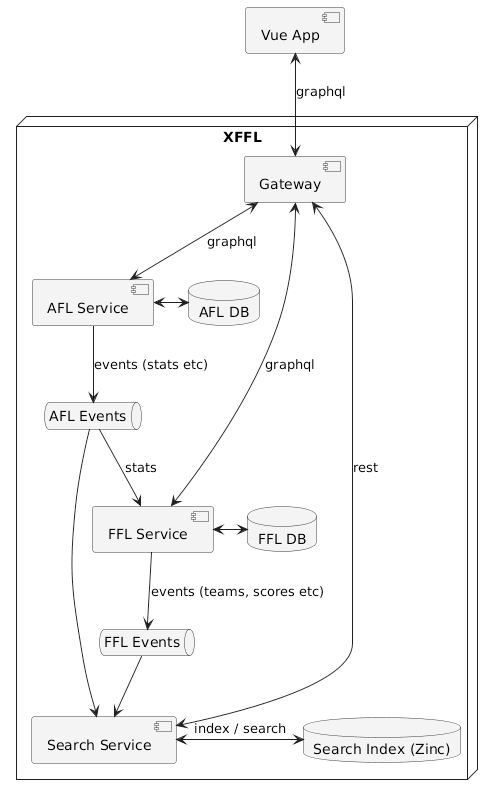
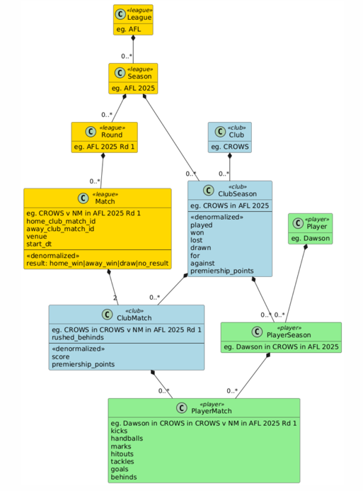
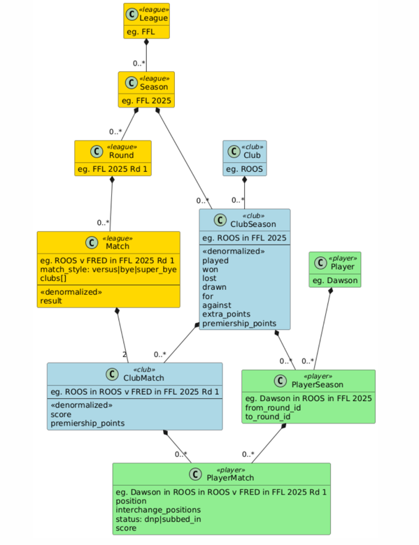

# xFFL — Fantasy Football League

Multi-service fantasy football application bridging real AFL statistics with fantasy league scoring and search.

- **AFL** = Australian Football League (real match data)
- **FFL** = Fantasy Football League (fantasy teams, scoring, ladder)

The X makes it sound cool.

**Tech stack:** Go, GraphQL, PostgreSQL, Zinc, Vue 3

## Architecture



### Data Models

| AFL | FFL |
|-----|-----|
|  |  |

PlantUML sources: [doc/logical-view.puml](doc/logical-view.puml), [doc/erd-afl.puml](doc/erd-afl.puml), [doc/erd-ffl.puml](doc/erd-ffl.puml)

See `ai/architecture/` for bounded contexts, service map, and principles.

### Frontend

Vue 3 + TypeScript SPA served by Vite (port 3000). Apollo Client manages server state via the GraphQL gateway — no separate state store. Tailwind CSS for styling (see ADR-011).

Frontend features follow user workflows, not backend services. The initial structure mirrors bounded contexts, but features may span services as the UI evolves.

    frontend/web/src/
    ├── features/afl/    → AFL views, components, GraphQL queries
    ├── app/             → Router, Apollo config, global CSS
    └── main.ts          → Entry point

### Architecture Decisions

This project uses a **service-oriented modular monolith** architecture. Services are logically separated and independently evolvable, but currently run in a single environment with a shared database. This is a deliberate choice — the boundaries are real, but the infrastructure complexity of true microservices is deferred until needed.

The architecture supports multiple evolution paths:

- **Stay Here:** The modular monolith may be all this project ever needs
- **True Microservices:** Separate databases, independent deployment, service mesh
- **Event-Driven Scale:** Migrate from PostgreSQL events to cloud messaging (AWS/GCP/Azure)
- **Event Sourcing:** Add event store, replay capabilities, full audit trails
- **Search Scale:** Evolve from Zinc to Elasticsearch/OpenSearch clusters

See `ai/decisions`.

## AI Control Plane

The `ai/` directory is a declarative interface between human architectural intent and AI implementation. Any AI tool can read it — not tied to a specific agent or framework.

| Doc                                  | Purpose                                             |
|--------------------------------------|-----------------------------------------------------|
| [CLAUDE.md](CLAUDE.md)               | Primary instructions for AI agents                  |
| [ai/architecture/](ai/architecture/) | Principles, service map, bounded contexts, repo map |
| [plans/](plans/)                     | Roadmap, current sprint, agent working memory       |
| [ai/decisions/](ai/decisions/)       | Architecture Decision Records                       |
| [ai/prompts/](ai/prompts/)           | Agent operating instructions                        |

See [ai/architecture/control-plane.md](ai/architecture/control-plane.md) for the full design.

## Getting Started

Prerequisites: Docker, Go 1.25+, Node.js 20+, [just](https://github.com/casey/just)

```sh
cp .env.example .env
just dev-up        # start Postgres + Zinc
just dev-seed      # load test data (optional)
```

For psql: `docker exec -it xffl-postgres psql -U postgres -d xffl`

To stop: `just dev-down` | To nuke and start fresh: `just dev-reset`

### Running

```sh
just run-all       # AFL service + gateway + frontend
```
Or individually: `just run-afl`, `just run-gateway`, `just run-frontend`

### Testing

```sh
just test-e2e      # Playwright e2e tests (requires run-all + dev-seed)
```

## Development Workflow

### What's next?

1. Check `plans/current-sprint.md` — see what's in progress
2. Check `plans/roadmap.md` — see the bigger picture
3. Open Claude Code and start working — it reads `CLAUDE.md` automatically

### How it works

The `ai/` directory is the interface between you (the human architect) and AI agents.

1. **You** define the *what* and *why* in `ai/` (architecture, plans, decisions)
2. **Agents** read `ai/` and do the *how* (code, tests, infrastructure)
3. **You** review, steer, and update `ai/` as the project evolves

### Daily loop

1. Update `plans/current-sprint.md` with today's focus
2. Open Claude Code — it picks up context from `CLAUDE.md` → `ai/`
3. Work with the agent: requirements → TDD → implement → review
4. Commit working code, update sprint tasks

### Evolution

The agentic workflow evolves incrementally based on real needs:

1. **Skills** (done) — `.claude/skills/` for repeatable validation (checkarch, checkdoc)
2. **Instrumentation** (future) — hooks for automatic observability
3. **More autonomy** (if needed) — only when human-in-the-loop becomes the bottleneck

No frameworks are adopted speculatively. Each layer is added when the previous one proves useful.
