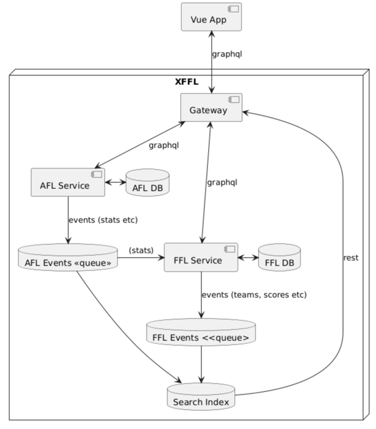

# xffl 

Multi-service fantasy football league application with both AFL and FFL services. Built as a modular architecture with experimentation into DDD, bounded contexts, clean architecture, CQRS, and search.

Totally over engineered for what it does, but, experimenting.

- **AFL** = Australian Football League  
- **FFL** = Fantasy Football League

Primary techs are Golang, GraphQL, Postgres, Vue, Zinc

Built with a lot of code agent.

## Table of Contents

- [Prerequisites](#prerequisites)
- [Dev Quick Start](#dev-quick-start)
- [Architecture](#architecture)
  - [Services Architecture](#services-architecture)
  - [Search Service Architecture](#search-service-architecture)
  - [Data Model](#data-model)
- [Architecture Decisions](#architecture-decisions)
  - [Current Architecture Choices](#current-architecture-choices)
  - [Migration Paths](#migration-paths)
- [Project Structure](#project-structure)
- [Database Setup](#database-setup)
  - [Installing PostgreSQL](#installing-postgresql)
  - [Database Configuration](#database-configuration)
  - [Running Migrations](#running-migrations)
  - [Test Data](#test-data)
- [Services Setup](#services-setup)
  - [Shared Package](#shared-package)
  - [AFL Service](#afl-service)
  - [FFL Service](#ffl-service)
  - [Gateway Service](#gateway-service)
- [Web](#web)
  - [Running the Frontend](#running-the-frontend)

## Prerequisites

- Go 1.16 or later
- Node.js 16 or later
- PostgreSQL 13 or later
- npm or yarn

## Dev Quick Start

Pre-req: Make sure the [database is set up and migrations have been run](#database-setup).

1. Start the FFL service:
   ```bash
   cd services/ffl
   go run cmd/server/main.go
   ```

2. Start the AFL service:
   ```bash
   cd services/afl
   go run cmd/server/main.go
   ```

3. Start the search service:
   ```bash
   cd services/search
   go run cmd/server/main.go
   ```

4. Start the gateway:
   ```bash
   cd gateway
   go run main.go
   ```

5. Start the frontend development server:
   ```bash
   cd frontend
   npm run dev
   ```

6. Access the application:
    - Frontend: http://localhost:3000 (uses gateway)
    - Gateway: http://localhost:8090/query
    - Search: http://localhost:8090/search
    - AFL GraphQL Playground: http://localhost:8080
    - FFL GraphQL Playground: http://localhost:8081
    - Search Service Direct: http://localhost:8082/search

## Architecture




### Services Architecture

Each service follows **Clean Architecture** with Go best practices:

#### Service Independence:
- **AFL Service** (`services/afl/`): Handles Australian Football League operations (port 8080)
- **FFL Service** (`services/ffl/`): Handles Fantasy Football League operations (port 8081)
- **Search Service** (`services/search/`): Handles search indexing and queries (port 8082)
- **Shared Package** (`pkg/`): Common utilities used by all services

#### Architecture Layers (per service):
- **Domain Layer** (`services/*/internal/domain/`): Pure business entities and domain logic
- **Services Layer** (`services/*/internal/services/`): Business orchestration with local interfaces
- **Adapters Layer** (`services/*/internal/adapters/`): Input/output adapters organized by type

#### Dependency Inversion Pattern:
- **Domain entities** are pure Go structs with no external dependencies
- **Database entities** live in db adapters with GORM annotations
- **Entity mapping**: Repository methods convert database ↔ domain entities
- **Repository interfaces** defined in service where they are consumed (Go idiom), implemented in db adapter
- This ensures domain entities have zero infrastructure dependencies and follows Go idioms

### Search Service Architecture

The Search Service provides technology-agnostic search capabilities with event-driven indexing:

#### Key Features:
- **Technology Agnostic**: Zinc adapter with migration path to Elasticsearch/OpenSearch
- **Event-Driven Indexing**: Subscribes to AFL/FFL domain events for eventual consistency
- **REST API**: Unified search endpoint accessible through gateway
- **Clean Architecture**: Domain entities, services, and adapters separation

#### Search Flow:
1. **Domain Events**: AFL/FFL services publish `player_match_updated` and `fantasy_score_calculated` events
2. **Event Processing**: Search service subscribes and processes events to create search documents
3. **Indexing**: Documents indexed in Zinc with structured metadata and tags
4. **Search**: Frontend queries via gateway REST endpoint (`/search?q=query&source=afl`)
5. **Results**: Structured search results with relevance scoring and pagination

#### Search Components:
- **Domain**: `SearchDocument`, `SearchQuery`, `SearchResults` value objects
- **Services**: `SearchService` (query execution), `IndexingService` (event processing)
- **Adapters**:
    - `ZincRepository` (search engine adapter)
    - `EventHandlers` (domain event subscribers)
    - `HTTPHandlers` (REST API endpoints)

#### Supported Queries:
- **Full-text search**: Players, clubs, matches across AFL and FFL
- **Filtering**: By source (`afl`, `ffl`), document type (`player`, `club`)
- **Sorting**: Score, relevance, custom fields
- **Pagination**: Limit/offset with total count

### Data Model

The application is designed to manage two types of leagues: AFL (Australian Football League) and FFL (Fantasy Football League). Each league has its own set of entities, including seasons, rounds, matches, clubs, and players.

Ostensibly, data is stored in first normal form (1NF). However, at this stage, to optimize read performance for the frontend, some data is denormalized. This includes pre-calculated fields like scores, premiership points, and match results.

#### AFL Data Model


#### FFL Data Model


## Architecture Decisions

This project demonstrates a **modular microservices architecture** that balances learning, experimentation, and future scalability. The choices made are deliberate for a hobby project that might grow.

### Current Architecture Choices

#### 🎯 **Independent Services with Shared Infrastructure**
- **Decision**: Separate AFL and FFL services sharing a common database and utilities
- **Why for Hobby**: Easy to develop and run locally, simple deployment, shared data model
- **Scale Path**: Services can be split to separate databases, deployed independently, or combined into a monolith if needed

#### 📦 **Go Workspace with Shared Package**
- **Decision**: `pkg/` directory for shared utilities, independent service modules
- **Why for Hobby**: Code reuse without duplication, workspace keeps everything in sync
- **Scale Path**: Extract `pkg/` to separate repository/module, or inline into services

#### 🔗 **GraphQL APIs per Service**
- **Decision**: Each service exposes its own GraphQL endpoint (AFL: 8080, FFL: 8081)
- **Why for Hobby**: Type-safe APIs, excellent developer experience, can test services independently
- **Scale Path**: Add GraphQL Gateway/Federation for unified frontend experience

#### 🚪 **GraphQL Gateway**
- **Decision**: Single gateway service that proxies to AFL and FFL services
- **Why for Hobby**: Unified frontend experience, simple CORS handling, easy to understand routing
- **Scale Path**: Add GraphQL Federation, complex query planning, schema stitching

#### 🎯 **Simple String-Based Routing**
- **Decision**: Route requests based on presence of "afl" or "ffl" in query text
- **Why for Hobby**: Zero configuration, predictable behavior, easy to debug
- **Scale Path**: GraphQL query parsing, field-level routing, federated schemas

#### 🗄️ **Shared Database with Schema Separation**
- **Decision**: Single PostgreSQL database with `afl.*` and `ffl.*` schemas
- **Why for Hobby**: Simple setup, easy cross-schema queries, single backup/restore
- **Scale Path**: Split to microservice-per-database, add read replicas, event sourcing

#### 🏗️ **Clean Architecture with Go Best Practices**
- **Decision**: Domain/Services/Adapters layers with Go-idiomatic local interfaces
- **Why for Hobby**: Enforces good separation, follows Go best practices, makes testing easier, educational value
- **Scale Path**: Patterns scale well, can add CQRS, event sourcing, or simplify to layered architecture

#### 🏗️ **Event System Architecture**
- **Decision**: Clean separation with `EventDispatcher` interface, strongly-typed domain events, serialized as json for cross-service messaging
- **Why for Hobby**: Testable event flows, asynchronous processing, cross-service functionality without HTTP coupling
- **Scale Path**: Swap implementations without changing application code, add event sourcing capabilities

#### 🎭 **Cross-Service Events with PostgreSQL LISTEN/NOTIFY**
- **Decision**: Implement cross-service communication using PostgreSQL's native pub/sub messaging for domain events
- **Why for Hobby**: Zero additional infrastructure, leverages existing database, minimal setup complexity, production-ready (used by Supabase, GitHub)
- **Scale Path**: Easy migration to NATS, Redis pub/sub, AWS EventBridge/SQS, GCP Pub/Sub, Apache Kafka via `EventDispatcher` interface

#### 🔍 **Dedicated Search Engine**
- **Decision**: Separate search service instead of PostgreSQL full-text search for player/team/match search functionality
- **Why for Hobby**: Better search UX with autocomplete and faceted search, analytics aggregations for statistics, event-driven indexing from domain events
- **Scale Path**: Index growth from single-node to distributed search clusters, add ML-powered relevance tuning

#### 🥇 **Zinc Search Engine**
- **Decision**: Zinc lightweight search engine over Elasticsearch/OpenSearch, Meilisearch, or Typesense
- **Why for Hobby**: Single Go binary (~40MB), Elasticsearch-compatible API, minimal resources (~100MB RAM), native Go ecosystem fit
- **Scale Path**: Direct migration to Elasticsearch/OpenSearch when scale demands, existing queries and indices remain compatible

#### 🚪 **Deployment Flexibility**
- **Decision**: Services can run in same Kubernetes pod or separate pods
- **Why for Hobby**: Start simple (same pod), easy resource sharing, localhost communication
- **Scale Path**: Independent pod deployment, auto-scaling, service mesh (Istio/Linkerd)

### Migration Paths

The architecture is designed to support multiple evolution paths:

1. **Monolith Consolidation**: Merge services into single binary if complexity isn't needed
2. **True Microservices**: Separate databases, independent deployment, service mesh
3. **Event-Driven Scale**: Migrate from PostgreSQL events to cloud messaging (AWS/GCP/Azure)
4. **Event Sourcing**: Add event store, replay capabilities, full audit trails
5. **Search Scale**: Evolve from Zinc to Elasticsearch/OpenSearch clusters with advanced ML features

## Project Structure

```
xffl/
├── infrastructure/             # Infrastructure and database setup
│   └── postgres/               # PostgreSQL configuration
│       ├── migrations/         # Database schema migrations
│       └── test_data/          # Test data scripts
├── services/                   # Independent microservices
│   ├── ffl/                    # Fantasy Football League service
│   │   ├── api/graphql/        # FFL GraphQL schema
│   │   ├── cmd/server/         # Service entry point
│   │   ├── internal/           # Service-specific code
│   │   │   ├── domain/         # FFL business entities & events
│   │   │   │   └── events/     # FFL domain events
│   │   │   ├── services/       # FFL services & event handlers
│   │   │   └── adapters/       # GraphQL resolvers, persistence
│   │   │       ├── graphql/    # GraphQL input adapters
│   │   │       └── db/         # Database output adapters
│   │   ├── go.mod              # FFL service dependencies
│   │   └── gqlgen.yml          # GraphQL generation config
│   ├── afl/                    # Australian Football League service
│   │   ├── api/graphql/        # AFL GraphQL schema
│   │   ├── cmd/server/         # Service entry point
│   │   ├── internal/           # Service-specific code
│   │   └── go.mod              # AFL service dependencies
│   └── search/                 # Search service
│       ├── cmd/server/         # Service entry point
│       ├── internal/           # Service-specific code
│       │   ├── domain/         # Search entities
│       │   ├── services/       # Search & indexing services
│       │   └── adapters/       # HTTP, events, zinc adapters
│       │       ├── http/       # REST API input adapters
│       │       ├── events/     # Event input adapeters
│       │       └── zinc/       # Zinc search output adapter
│       └── go.mod              # Search service dependencies
├── gateway/                    # GraphQL Gateway service
│   ├── main.go                 # Gateway implementation
│   └── go.mod                  # Gateway dependencies
├── pkg/                        # Shared packages
│   ├── database/               # Database connection utilities
│   ├── events/                 # Cross-service event system
│   │   ├── memory/             # In-memory event dispatcher
│   │   ├── postgres/           # PostgreSQL LISTEN/NOTIFY dispatcher
│   │   └── examples/           # Event system examples & demos
│   └── go.mod                  # Shared package dependencies
├── frontend/                   # Vue.js frontend
│   ├── src/                    # Source code
│   ├── public/                 # Static assets
│   └── index.html              # Entry HTML file
└── go.work                     # Go workspace configuration
```

## Database Setup

The application uses PostgreSQL as its database. Here's how to set it up:

### Installing PostgreSQL

#### macOS
```bash
# Install PostgreSQL using Homebrew
brew install postgresql@14

# Start PostgreSQL as service
# If using port other than 5432, you may need to adjust configuration, eg at
# /opt/homebrew/var/postgresql@14/postgresql.conf
brew services start postgresql@14

# Or, if you don't want/need a background service you can just run:
/usr/local/opt/postgresql@14/bin/postgres -D /usr/local/var/postgresql@14

# Create the database
createdb xffl

# Create a PostgreSQL user (if not exists)
createuser -s postgres

# Set password for postgres user
psql postgres -c "ALTER USER postgres WITH PASSWORD 'postgres';"
```

#### Linux (Ubuntu/Debian)
```bash
# Install PostgreSQL
sudo apt update
sudo apt install postgresql postgresql-contrib

# Start PostgreSQL service
sudo systemctl start postgresql
sudo systemctl enable postgresql

# Create the database
sudo -u postgres createdb xffl

# Set password for postgres user
sudo -u postgres psql -c "ALTER USER postgres WITH PASSWORD 'postgres';"
```

### Database Configuration

The application uses environment variables for database configuration. Copy the example environment file and customize for your setup:

```bash
# For FFL service
cp services/ffl/.env.example services/ffl/.env
# Edit services/ffl/.env with your database credentials

# For AFL service
cp services/afl/.env.example services/afl/.env
# Edit services/afl/.env with your database credentials
```

Example configuration:
```
DB_HOST=localhost
DB_USER=postgres
DB_PASSWORD=your_password_here
DB_NAME=xffl
DB_PORT=5432
```

**Note**: `.env` files are ignored by git for security. Never commit actual credentials to the repository.

### Running Migrations

The database schema is managed through SQL migration files in the `infrastructure/postgres/` directory. To apply the migrations:

```bash
# AFL migrations
psql -U postgres -d xffl -f infrastructure/postgres/migrations/001_create_afl_tables_up.sql

# FFL migrations  
psql -U postgres -d xffl -f infrastructure/postgres/migrations/002_create_ffl_tables_up.sql
```

You can revert by running the down migrations.

### Test Data

Test data scripts are available in the infrastructure directory. To insert test data:

```bash
# AFL test data
psql -U postgres -d xffl -f infrastructure/postgres/test_data/insert_afl_data.sql

# FFL test data
psql -U postgres -d xffl -f infrastructure/postgres/test_data/insert_ffl_data.sql
```

## Services Setup

The application consists of multiple Go services using a shared package for common functionality.

### Shared Package

The `pkg/` directory contains shared utilities used by all services:

```bash
# Validate the shared package
cd pkg
go mod tidy
go test ./...
```

### AFL Service

```bash
# Generate GraphQL code  
cd services/afl
go run github.com/99designs/gqlgen generate

# Build the service
go build -o bin/server cmd/server/main.go

# Or run directly
go run cmd/server/main.go
```

The AFL service will start on `http://localhost:8080`with:
- `/query` - GraphQL API endpoint
- `/` - GraphQL playground for testing queries

### FFL Service

```bash
# Generate GraphQL code
cd services/ffl
go run github.com/99designs/gqlgen generate

# Build the service
go build -o bin/server cmd/server/main.go

# Or run directly
go run cmd/server/main.go
```

The FFL service will start on `http://localhost:8081` with:
- `/query` - GraphQL API endpoint
- `/` - GraphQL playground for testing queries

### Gateway Service

The gateway provides a unified GraphQL endpoint for the frontend, routing requests to the appropriate backend services.

```bash
# Run the gateway
cd gateway
go run main.go
```

The gateway will start on `http://localhost:8090` with:
- `/query` - Unified GraphQL endpoint
- `/health` - Health check endpoint

#### Gateway Routing Logic

The gateway uses simple string-based routing:
- Queries containing `afl` → AFL service (port 8080)
- Queries containing `ffl` → FFL service (port 8081) 
- Queries containing `_gateway` → Gateway metadata (handled locally)
- All other queries → FFL service (default)

## Web

### Running the Frontend

```bash
cd frontend
npm install
npm run dev
```

The frontend will be available at `http://localhost:3000`.
