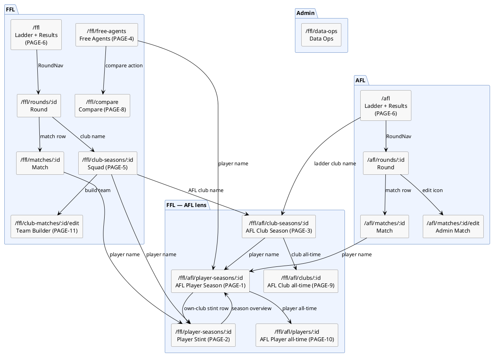

# Ideas

Aspirational ideas, designs, and things to revisit. Not commitments. Some items have stable IDs for referencing from the roadmap.

---

## UX Vision

### Navigation

(No outstanding navigation items.)

### Pages

| ID | Route | Status | What it shows | Effort |
|---|---|---|---|---|
| PAGE-1 | `/ffl/afl/player-seasons/:aflPlayerSeasonId` | Built | FFL league view of one AFL player's season: all FFL ownership stints + unowned gaps, per-round k/h/m/t/r/g + * score + FFL position + FFL club. Most valuable page in the system. | M |
| PAGE-2 | `/ffl/player-seasons/:fflPlayerSeasonId` | Expand-row in SquadView; not a full page | One club's ownership of a player: club-specific notes, averages scoped to "while they were mine", per-round breakdown. | S |
| PAGE-3 | `/ffl/afl/club-seasons/:clubSeasonId` | Built | All players at an AFL club this season: name / FFL club / k/h/m/t/r/g / * avg. Entry from AFL ladder club names. | M |
| PAGE-4 | `/ffl/free-agents` | Not built | All unowned AFL players, sorted by * avg desc. Filterable by position. Columns: name / AFL club / position / * avg / last round score. Primary trade-target intelligence tool. | M |
| PAGE-5 | `/ffl/club-seasons/:id` (expand) | SquadView exists; dashboard additions not built | Add to top of SquadView: total * scored this season, points by round (sparkline or table), top scorer, W/L/D record. Squad list below unchanged. | S |
| PAGE-6 | `/ffl` and `/afl` (expand) | Ladder exists; results matrix not built | Add round-by-round W/L/D grid alongside the standard ladder — traditional FFL results page format. Entry point: NAV-3 Ladder pill. | S |
| PAGE-8 | `/ffl/compare` | Not built | Pick 2–3 AFL players via search, compare stats/FFL scores side-by-side. Shareable URL (player IDs in query params). | L |
| PAGE-9 | `/ffl/afl/clubs/:aflClubId` | Future — needs 2+ seasons | All-time FFL history of an AFL club across seasons: players drafted, aggregate scoring, per-season breakdown. | — |
| PAGE-10 | `/ffl/afl/players/:aflPlayerId` | Future — needs 2+ seasons | All-time FFL career of an AFL player across seasons: FFL clubs, total * points, FFL games played. | — |
| PAGE-11 | Team Builder analytics (enrich `/ffl/club-matches/:id/edit`) | Not built | Surface season averages, rolling averages, and last-N-games stats per player at team-building time. Season average is the first use case and feeds into bye scoring. | M |

### Pending surface

Fields in the schema, populated by backend processes, not yet rendered in the UI. Planned for Phase 23.

| Field | Written by | Proposed UX home |
|---|---|---|
| `FFLClubMatch.notes` | FFL import (score reconciliation rationale) | FFL match view — alongside club match score |
| `FFLPlayerMatch.notes` | FFL import (posted player scores) | FFL match view — alongside individual player scores |

### Design notes

- **No pure AFL player/club pages.** AFL section stays as-is (ladder / rounds / matches). AFL match player links and AFL ladder club links point to their FFL-lens equivalents (PAGE-1, PAGE-3).
- **`/ffl/afl/` sub-namespace** for FFL's view of AFL entities. Future all-time pages (PAGE-9, PAGE-10) follow naturally.
- **Traded player example** on PAGE-1 (`/ffl/afl/player-seasons/42`):
  ```
  Rnd   FFL Club    Pos   K   H   M   T   R   G    *
  1–4   (unowned)   —     8   6   3   2   0   0    —
  5–10  Ruiboys     DEF   9   5   4   3   0   0   38
  11–13 Cheetahs    MID  11   7   2   4   1   0   52
  ```

### Backend work per new page

| Page | Backend needed |
|---|---|
| PAGE-1 | FFL query by AFL player season ID; return all FFL stints + unowned rounds; cross-subgraph via federation |
| PAGE-2 | Likely exists; may need a dedicated `fflPlayerSeason(id)` resolver with more detail than SquadView currently fetches |
| PAGE-3 | Built — `aflClubSeason(id)` resolver with FFL ownership via federation |
| PAGE-4 | New resolver or filter on existing player queries: unowned players cross-joined with season averages |
| PAGE-8 | No new backend; reuses existing player season queries |
| PAGE-11 | No new backend; reuses existing player season stat queries already available for SquadView |

### Navigation map



---

## Pre-match AFL player naming

**What:** AFL clubs announce their teams a day or two before a match (typically Thursday for a Saturday game). The named squad may change before the match starts — late omissions, bench trimming, injury replacements. Currently xffl has no record of a player being "named" before the match starts. A player either has stats (played) or has no record at all.

Note: separate from *player availability* (injury/suspension status, Phase 24) — availability is a season-long state; naming is a per-match pre-game event.

**Why parked:** Purely informational for the current workflow — does not affect scoring or ladder calculations. The data ops workflow only imports stats once matches are complete or in progress. Adding pre-match tracking before the data pipeline is established adds complexity with no near-term payoff. The event model was deliberately designed to accommodate it later without breaking changes.

**What would need to change:**

*AFL domain and data ops:*
- A new status value `named` for AFL PlayerMatch: player is registered for this match but no stats yet.
- A data source for pre-match squads (AFL website, Champion Data feed, or manual entry via Data Ops UI).
- `AFL.MatchUpdated (partial)` payload would include named-but-not-yet-played players at status `"named"` alongside players with stats at `"playing"`.

*FFL domain:*
- `drv_afl_status = named` reinstated on `ffl.player_match`: player is linked to an AFL PlayerMatch but the match has not started.
- FFL UI Team Builder could show pre-match squad status before games begin (useful for TMs planning subs in advance).

*Event flow:*
- `AFL.MatchUpdated` `PlayerSeasonIDStatusMap` would carry `"named"` as a valid third value alongside `"playing"`, `"played"`, `"dnp"`.
- On `partial` transition: players previously `named` who now have stats transition to `"playing"`; those still without stats remain `"named"`.
- On `final`: players still `"named"` become `"dnp"`.
- No new events needed — `AFL.MatchUpdated` already fires on state transitions; the map just gains richer values.

---

## CQRS player stats read model

Move AFL player stats reads from GraphQL/PostgreSQL to the search index as query volume grows (ADR-013). SquadView and other stat-heavy pages would query the index instead of the DB. Defer until query performance is actually a problem.

---

## Other Ideas

- **Live AFL data source** — afltables may serve for weekly reconciliation once historical load is complete, but a real-time feed would unlock live in-progress scoring
- **Mobile app**
- **Backup remote destination** — rclone supports S3, GCS, B2 with a single consistent interface; decide when deployment target is clearer

---

## Revisit

### GraphQL traversal shortcuts

Fields like `FFLPlayerMatch.player` let callers skip `playerSeason → player`; `FFLPlayerMatch.playerSeasonId` is a bare FK when the object is already reachable. Audit all types in `query.graphqls` for relations that duplicate an existing traversal, then decide whether to remove the shortcut or keep it as a convenience alias.
