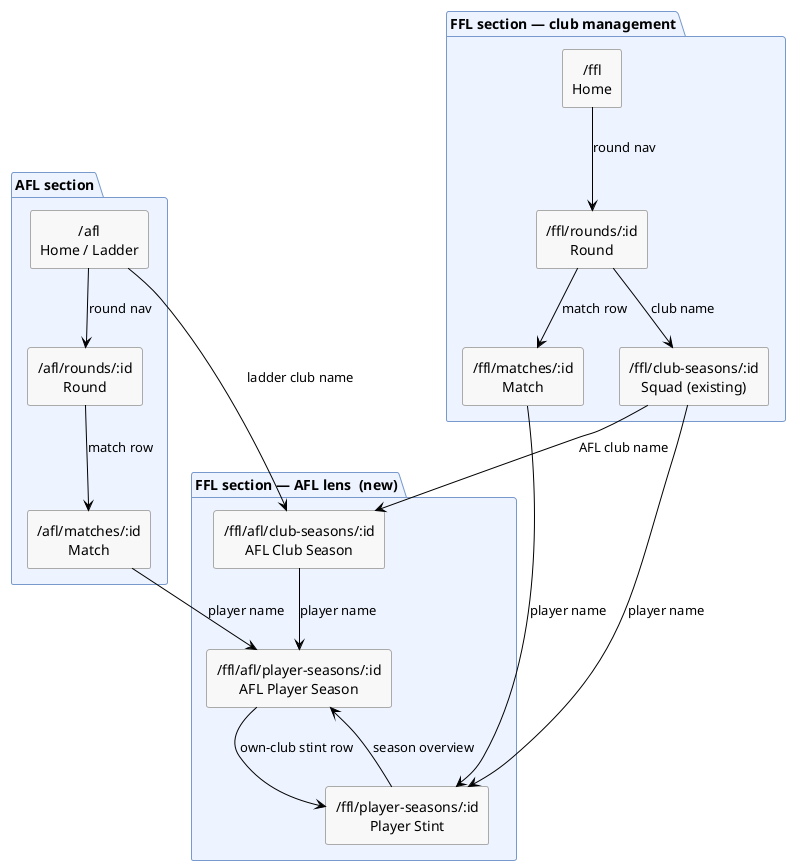

# Player & Club Pages — Design

Planning doc. Will be folded into roadmap (likely expanding Phase 22) once prioritised.

---

## Decisions

- **No pure AFL pages (A1/A2).** The AFL section stays as-is (home / rounds / matches). AFL ladder club links and AFL match player links point to their FFL-lens equivalents.
- **URL scheme:** `/ffl/afl/` sub-namespace for FFL's view of AFL entities.
- **Future all-time pages** (`/ffl/afl/clubs/:id`, `/ffl/afl/players/:id`) follow the same namespace naturally.

---

## Pages

### Player pages

| URL | Key | What it shows |
|---|---|---|
| `/ffl/afl/player-seasons/:aflPlayerSeasonId` | `afl.player_season.id` | FFL league view — all FFL ownership stints across the season (incl. unowned gaps), per-round k/h/m/t/r/g + * score + FFL position |
| `/ffl/player-seasons/:fflPlayerSeasonId` | `ffl.player_season.id` | FFL club view — one ownership stint, club-specific notes, averages scoped to that stint |

**Why each page exists:**

- `/ffl/afl/player-seasons/` — the most valuable page in the system. Nowhere else shows FFL scoring + FFL ownership history for an AFL player in one place. Unowned periods are visible (trade-target intelligence). Entry point from AFL match view and FFL squad view.
- `/ffl/player-seasons/` — one club's ownership stint. Notes are private to that club. Averages scoped to "while they were mine". Already partially exists as the expand-row in SquadView; this is a promotion to a full page.

**Traded player example** on `/ffl/afl/player-seasons/42`:
```
Rnd   FFL Club    Pos   K   H   M   T   R   G    *
1–4   (unowned)   —     8   6   3   2   0   0    —
5–10  Ruiboys     DEF   9   5   4   3   0   0   38
11–13 Cheetahs    MID  11   7   2   4   1   0   52
```
The `/ffl/player-seasons/` for Ruiboys is a separate page covering rounds 5–10 with Ruiboys' own notes.

---

### Club pages

| URL | Key | What it shows |
|---|---|---|
| `/ffl/afl/club-seasons/:aflClubSeasonId` | `afl.club_season.id` | FFL league view of an AFL club — all players, FFL ownership, * averages (see layout below) |

`/ffl/club-seasons/:fflClubSeasonId` already exists (SquadView). No new page needed.

**`/ffl/afl/club-seasons/:id` page layout — multiple sections:**

1. **Master table** — all players at this AFL club (including unowned), alpha default, sortable columns: name / FFL club / position(s) / k / h / m / t / r / g / * avg.
2. **FFL ownership summary** — "6 Ruiboys, 4 Cheetahs, 3 unowned"; total * scoring contribution per FFL club from this AFL club's players.
3. **Best unowned** — sublist of unowned players sorted by * average desc. *(A full cross-club free-agent list is a separate future feature.)*

---

### Future all-time pages (noted, not scoped)

- `/ffl/afl/clubs/:aflClubId` — FFL history of an AFL club across all seasons (how many players drafted, aggregate scoring over the years, etc.)
- `/ffl/afl/players/:aflPlayerId` — FFL career of an AFL player (how many seasons, which FFL clubs, total * points, FFL games played, etc.)

---

## Navigation diagram



---

## Backend work per page

| Page | Backend needed |
|---|---|
| `/ffl/afl/player-seasons/` | FFL query by AFL player season ID; return all FFL stints + unowned rounds; cross-subgraph via federation |
| `/ffl/player-seasons/` | Largely exists; may need a dedicated `fflPlayerSeason(id)` resolver with more detail than SquadView currently fetches |
| `/ffl/afl/club-seasons/` | New resolver: `AFLClubSeason.players → [AFLPlayerSeason!]!`; FFL ownership joined in via federation |